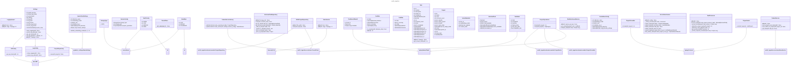

```mermaid
---
title: aerith_ingestion
---
classDiagram
    class LoggingAspect {
        - __init__(self, func) None
        - __call__(self, *args, **kwargs) R
    }

    class LogConfig {
        + setup_logging(self) None
        + ensure_log_path(self) None
    }

    class APIConfig {
        + get_api_token(self) str
    }

    class VectorStoreSettings {
        + str collection_name
        + str embedding_model
        + int batch_size
        + int similarity_top_k
        + Optional[str] persist_directory
        + Dict[str, Any] chroma_settings
        + validate_embedding_model(cls, v) str
    }

    class Settings {
        + str openai_api_key
        + str todoist_api_token
        + str environment
        + bool debug
        + str log_path
        + str log_level
        + str log_format
        + str trace_log_format
        + str error_log_format
        + VectorStoreSettings vector_store
        + setup_logging(self) None
        + ensure_log_path(self) None
        + get_api_token(self) str
        + set_log_level(cls, v, values) str
        - __init__(self, **kwargs) None
    }

    class StorageType {
        + JSON
    }

    class ServiceConfig {
        + StorageType storage_type
        + str storage_path
        + ProjectOperations project_operations
    }

    class TodoistServiceFactory {
        + @staticmethod create_repository(config) ProjectRepository
        + @classmethod create_service(cls, settings, service_config) TodoistService
    }

    class TracedClass {
        - __init_subclass__(cls) None
    }

    class BaseService {
        - __init__(self, func) None
        - __call__(self, *args, **kwargs) R
    }

    class JSONProjectRepository {
        - __init__(self, file_path) None
        + save(self, projects) None
    }

    class EnrichedTaskRepository {
        - __init__(self, storage_dir) None
        + save(self, enriched_task) None
        + get_by_id(self, task_id) Optional[EnrichedTask]
        + get_all_processed_tasks(self) Dict[str, datetime]
        - _task_to_dict(self, task) dict
        - _project_to_dict(self, project) dict
        - _dict_to_task(self, data) Task
        - _dict_to_project(self, data) Project
    }

    class ViewStyle {
        + str LIST
        + str BOARD
        + str CALENDAR
    }

    class TaskPriority {
        + int NONE
        + int LOW
        + int MEDIUM
        + int HIGH
    }

    class TaskStats {
        + int total
        + int completed
        + int overdue
        + int high_priority
        + int has_due_date
        + float completion_rate
    }

    class DueDate {
        + str date
        + Optional[datetime] datetime
        + Optional[str] timezone
        + bool is_recurring
        + Optional[str] string
        + is_overdue(self, reference_time) bool
        - __str__(self) str
    }

    class TaskDue {
        + str date
        + bool is_recurring
        + str string
        + Optional[str] datetime
        + Optional[str] timezone
    }

    class Task {
        + str id
        + str content
        + str description
        + str project_id
        + str created_at
        + Optional[TaskDue] due
        + int priority
        + str url
        + int comment_count
        + int order
        + bool is_completed
        + List[str] labels
        + Optional[str] parent_id
        + Optional[str] assignee_id
        + Optional[str] assigner_id
        + Optional[str] section_id
        + Optional[int] duration
        + Optional[str] sync_id
        - __init__(self, **kwargs) None
        + get_content_hash(self) str
    }

    class Project {
        + str id
        + str name
        + str color
        + int comment_count
        + bool is_favorite
        + bool is_inbox_project
        + bool is_shared
        + bool is_team_inbox
        + Optional[bool] can_assign_tasks
        + int order
        + Optional[str] parent_id
        + str url
        + str view_style
        + List[Task] tasks
    }

    class VectorMetadata {
        + str doc_id
        + str embedding_model
        + datetime last_updated
        + str content_hash
    }

    class EnrichedTask {
        + Task task
        + Project project
        + Dict[str, Any] metadata
        + Optional[List[float]] embeddings
        + Optional[VectorMetadata] vector_metadata
        + datetime processed_at
    }

    class ProjectSorter {
        + sort(self, projects) List[Project]
    }

    class ProjectFormatter {
        + format(self, project) str
    }

    class ProjectRepository {
        + save(self, projects) None
    }

    class TaskEnrichmentService {
        - __init__(self, openai_api_key) None
        + get_embeddings(self, text) List[float]
        + analyze_task(self, task) Dict[str, Any]
    }

    class VectorStoreConfig {
        + str collection_name
        + str embedding_model
        + int batch_size
        + int similarity_top_k
        + Optional[str] persist_directory
        + Optional[Dict[str, Any]] chroma_settings
    }

    class TaskSearchResult {
        + str task_id
        + float score
        + Dict[str, Any] metadata
    }

    class VectorStoreService {
        - __init__(self, config) None
        - _create_document(self, task) Document
        + upsert_tasks(self, tasks) List[VectorMetadata]
        + upsert_task(self, enriched_task) VectorMetadata
        + delete_tasks(self, task_ids) None
        + delete_task(self, task_id) None
        + search_tasks(self, query, filters, top_k) List[TaskSearchResult]
        + find_similar_tasks(self, task, project_id, top_k) List[TaskSearchResult]
    }

    class TaskProcessor {
        - __init__(self) None
        + process_task(self, task, project, previous_task) Optional[EnrichedTask]
        - _extract_metadata(self, task, project) Dict[str, Any]
        - _determine_project_type(self, project) str
        - _determine_task_type(self, task) str
        - _get_priority_level(self, priority) str
        - _extract_temporal_metadata(self, task) Dict[str, Any]
    }

    class TodoistService {
        - __init__(self) None
        + sync_projects_and_tasks(self) None
        + sync_tasks_for_project(self, project_id) None
        + get_task(self, task_id) None
    }

    class ProjectOperations {
        + format(self, project) str
        + sort(self, projects) List[Project]
    }

    LogConfig --|> `abc.ABC`

    APIConfig --|> `abc.ABC`

    VectorStoreSettings --|> `pydantic_settings.BaseSettings`

    Settings --|> `pydantic_settings.BaseSettings`

    Settings --|> LogConfig

    Settings --|> APIConfig

    StorageType --|> `enum.Enum`

    TodoistServiceFactory --|> `aerith_ingestion.core.base.TracedClass`

    BaseService --|> `Generic[P, R]`

    JSONProjectRepository --|> `aerith_ingestion.core.base.TracedClass`

    JSONProjectRepository --|> `aerith_ingestion.domain.models.ProjectRepository`

    ViewStyle --|> str

    ViewStyle --|> `enum.Enum`

    TaskPriority --|> int

    TaskPriority --|> `enum.Enum`

    TaskStats --|> `typing.NamedTuple`

    ProjectSorter --|> `typing.Protocol`

    ProjectFormatter --|> `typing.Protocol`

    ProjectRepository --|> `abc.ABC`

    TaskSearchResult --|> `typing.NamedTuple`

    TodoistService --|> `aerith_ingestion.core.base.BaseService`

    ProjectOperations --|> `aerith_ingestion.core.base.TracedClass`

    ProjectOperations --|> `aerith_ingestion.domain.models.ProjectFormatter`

    ProjectOperations --|> `aerith_ingestion.domain.models.ProjectSorter`
```
