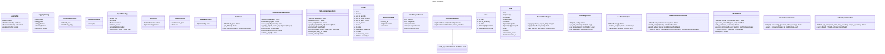

```mermaid
---
title: aerith_ingestion
---
classDiagram
    class AppConfig {
        + ApiConfig api
        + DatabaseConfig database
        + EnrichmentConfig enrichment
        + LoggingConfig logging
    }

    class LoggingConfig {
        + str log_path
        + str log_level
        + str log_format
        + str error_format
        + str console_format
    }

    class EnrichmentConfig {
        + int batch_size
        + int similarity_top_k
    }

    class TodoistApiConfig {
        + str api_key
    }

    class OpenAIConfig {
        + str api_key
        + str model
        + float temperature
        + int max_tokens
        + str embedding_model
        + Optional[str] vector_index_path
    }

    class ApiConfig {
        + TodoistApiConfig todoist
        + OpenAIConfig openai
    }

    class SQLiteConfig {
        + str database_path
        + bool echo
    }

    class DatabaseConfig {
        + SQLiteConfig sqlite
    }

    class Database {
        - __init__(self, db_path) None
        - _init_db(self) None
        + get_connection(self) sqlite3.Connection
    }

    class SQLiteProjectRepository {
        - __init__(self, database) None
        + save(self, project) None
        + save_all(self, projects) None
        + get_by_id(self, project_id) Optional[Project]
        + get_all(self) List[Project]
        + delete(self, project_id) None
        + delete_all(self) None
    }

    class SQLiteTaskRepository {
        - __init__(self, database) None
        + save(self, task) None
        + save_all(self, tasks) None
        + get_by_id(self, task_id) Optional[Task]
        + get_all(self) List[Task]
        + get_by_project_id(self, project_id) List[Task]
        + delete(self, task_id) None
        + delete_all(self) None
    }

    class Project {
        + str id
        + str name
        + bool is_favorite
        + bool is_inbox_project
        + bool is_team_inbox
        + bool is_shared
        + str url
        + str color
        + Optional[str] parent_id
        + int order
        + int comment_count
        + datetime created_at
    }

    class VectorMetadata {
        + str task_id
        + List[float] vector
        + str content
    }

    class TaskAnalysisResult {
        + str category
        + str complexity
        + List[str] themes
        + List[str] dependencies
        + List[str] next_actions
    }

    class EnrichedTaskData {
        + Optional[TaskAnalysisResult] analysis
        + Optional[VectorMetadata] vector_metadata
    }

    class Due {
        + str date
        + bool is_recurring
        + str string
        + Optional[str] datetime
        + Optional[str] timezone
    }

    class Task {
        + str id
        + str project_id
        + str content
        + str description
        + int priority
        + Optional[Due] due
        + Optional[str] parent_id
        + str url
        + int order
        + int comment_count
        + datetime created_at
    }

    class TodoistDataMapper {
        + map_project(self, project_data) Project
        + map_task(self, task_data) Task
        - _map_due(self, due_data) Optional[Due]
    }

    class TodoistApiClient {
        - __init__(self, config) None
        + get_all_data(self) Dict[str, Any]
        + get_projects(self) List[Dict[str, Any]]
        + get_tasks(self) List[Dict[str, Any]]
    }

    class LLMTaskAnalyzer {
        - __init__(self, config) None
        + analyze_task(self, task) TaskAnalysis
        - _call_llm(self, prompt) Dict[str, Any]
    }

    class TaskEnrichmentWorkflow {
        - __init__(self, task_analyzer, vector_store) None
        + enrich_task(self, task) EnrichedTaskData
        + enrich_all(self, tasks) List[EnrichedTaskData]
        - _generate_vector_metadata(self, task, analysis) Optional[VectorMetadata]
    }

    class VectorStore {
        - __init__(self, openai_client, index_path) None
        + generate_embedding(self, text) List[float]
        + add_vector(self, metadata) None
        + search_similar(self, query_text, k) List[VectorMetadata]
        - _load_or_create_index(self) faiss.Index
        + save(self) None
    }

    class VectorSearchService {
        - __init__(self, embedding_generator, index_storage) None
        + search_similar(self, query, k) List[Dict[str, Any]]
    }

    class TodoistSyncWorkflow {
        - __init__(self, api_client, data_sync, task_repository, project_repository) None
        + sync_all(self) Tuple[List[Project], List[Task]]
    }

    EnrichedTaskData --|> `aerith_ingestion.domain.task.task.Task`
```
