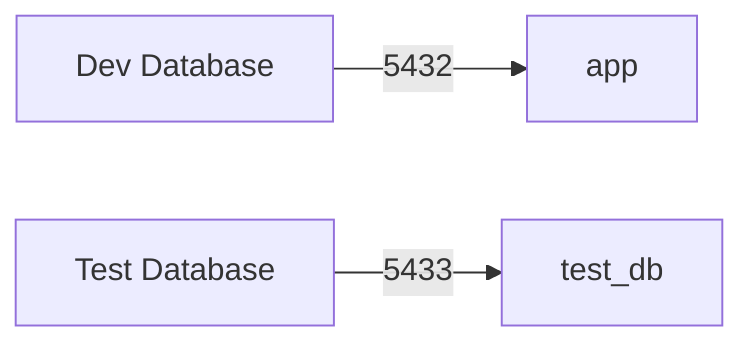

# Aerith Ingestion MVP Product Requirements Document

## Project Structure ✅
```
mvp/
  app/           # Next.js application
    src/         # Source code
      server/    # Server-side code
        api/     # tRPC API layer ✅
          routers/  # Entity routers ✅
          root.ts   # Root router config ✅
          trpc.ts   # tRPC setup ✅
        db/      # Database layer
          schema/  # Database schemas ✅
          seed.ts   # Database seeding script ✅
    drizzle/     # Database migrations ✅
    public/      # Static assets
```

## Primary Goal

Create a complete GTD (Getting Things Done) implementation covering all Horizons of Focus, with a modern web interface.

## Core Entities ✅

### Common Entity Pattern ✅
All entities share base properties:
```typescript
{
    id: uuid primary key,
    userId: varchar(255) references users(id) on delete cascade,
    name: varchar(100) not null,
    description: text,
    status: specific_enum,
    targetDate: timestamp with time zone optional,
    createdAt: timestamp with time zone not null default current_timestamp,
    updatedAt: timestamp with time zone not null default current_timestamp
}
```

### Horizon 5: Purpose & Principles (50,000 ft) ✅
```typescript
purposes {
    ...common_fields,
    status: enum('active', 'archived')
}
```
- Life purpose and core values
- No parent entity
- No target date
- Unique name per user

### Horizon 4: Vision (40,000 ft) ✅
```typescript
visions {
    ...common_fields,
    purposeId: uuid references purposes(id) on delete cascade,
    status: enum('active', 'achieved', 'archived'),
    targetDate: timestamp with time zone // 3-5 year timeframe
}
```
- Long-term outcomes
- Unique name per user
- Indexed by target date

### Horizon 3: Goals (30,000 ft) ✅
```typescript
goals {
    ...common_fields,
    visionId: uuid references visions(id) on delete cascade,
    status: enum('active', 'achieved', 'archived'),
    targetDate: timestamp with time zone // 1-2 year timeframe
}
```
- Medium-term objectives
- Unique name per user
- Indexed by target date

### Horizon 2: Areas (20,000 ft) ✅
```typescript
areas {
    ...common_fields,
    goalId: uuid references goals(id) on delete cascade,
    status: enum('active', 'archived', 'evergreen')
}
```
- Key life/work domains
- Unique name per user
- No target date needed

### Horizon 1: Projects (10,000 ft) ✅
```typescript
projects {
    ...common_fields,
    areaId: uuid references areas(id) on delete cascade,
    status: enum('active', 'completed', 'archived'),
    targetDate: timestamp with time zone optional
}
```
- Specific outcomes
- Unique name per user
- Optional target date

### Ground: Tasks (Runway) ✅
```typescript
tasks {
    ...common_fields,
    projectId: uuid references projects(id) on delete cascade,
    status: enum('active', 'completed'),
    dueDate: timestamp with time zone optional
}
```
- Next physical actions
- Unique name per user
- Optional due date

## Database Design ✅

### Indexes ✅
Each entity has the following indexes:
- Primary key on `id`
- Foreign key index on `userId`
- Foreign key index on parent entity id (e.g., `purposeId`, `visionId`, etc.)
- Status index for filtering
- Date index where applicable (target/due dates)
- Unique compound index on `(userId, name)` for name uniqueness per user

### Cascading Deletes ✅
All foreign key relationships use `ON DELETE CASCADE` to maintain referential integrity:
- Deleting a user deletes all their entities
- Deleting a parent entity deletes all its children

## Validation Rules ✅

### Common Rules (All Entities)
- Name: Required, 3-100 characters
- Description: Optional, no length limit
- User must be authenticated
- Names must be unique per user within same level
- Parent entity must exist and be active
- Target/due dates must be in future when provided

### Status Transitions ✅
- Purpose: active ↔ archived
- Vision: active → achieved → archived
- Goals: active → achieved → archived
- Areas: active ↔ archived, active → evergreen
- Projects: active → completed → archived
- Tasks: active ↔ completed

### Entity-Specific Rules ✅

#### Areas
- Cannot be archived with active projects
- Can be evergreen (permanent)
- Must belong to active goal
- Can only move under active goals

#### Projects
- Cannot be completed with active tasks
- Cannot be created under archived areas
- Can move between active/evergreen areas
- Target date optional but must be future

#### Tasks
- Simple two-state workflow
- Must belong to active project
- Can only move under active projects
- Due date optional but must be future

## API Layer Implementation ✅

### Base Router Features
1. Authentication Context ✅
   - Discord OAuth session integration
   - User authentication middleware
   - Error handling middleware
   - Request logging

2. Input Validation ✅
   - Zod schema validation
   - Common validation patterns
   - Custom validators for GTD rules
   - Sanitization of user input

3. CRUD Operations ✅
   - Standardized CRUD patterns
   - Pagination support
   - Sorting capabilities
   - Filtering patterns

### Entity-Specific Features ✅
Each entity router implements:
1. Creation ✅
   - Parent entity validation
   - Name uniqueness checks
   - Status validation
   - Date validation

2. Listing ✅
   - Filtered by parent entity
   - Status filtering
   - Date range filtering
   - Hierarchy information

3. Updates ✅
   - Status transition validation
   - Parent entity validation
   - Dependency checks
   - Timestamp management

4. Deletion ✅
   - Cascade validation
   - Dependency checking
   - Active children checks

### Purpose Router Implementation ✅
1. Core Features
   - Create purpose with validation ✅
   - List purposes with filtering ✅
   - Update purpose with status transitions ✅
   - Delete purpose with cascade ✅

2. Validation Rules
   - Name uniqueness per user ✅
   - Status transitions (active ↔ archived) ✅
   - Required fields validation ✅
   - Authentication checks ✅

3. Test Coverage
   - Create procedure tests ✅
   - List procedure tests ✅
   - Update procedure tests ✅
   - Delete procedure tests ✅
   - Error handling tests ✅

## Performance Requirements

### API Performance
1. Response Times
   - List operations: < 100ms
   - CRUD operations: < 200ms
   - Batch operations: < 500ms
   - Search operations: < 150ms

2. Scalability
   - Support up to 1000 entities per user
   - Handle 100 concurrent users
   - Maximum payload size: 1MB
   - Rate limiting: 100 requests/minute

### UI Performance
1. Initial Load
   - First paint: < 1s
   - Time to interactive: < 2s
   - Route changes: < 300ms
   - Data prefetching

2. Runtime
   - Frame rate: 60fps
   - Input latency: < 100ms
   - Animation smoothness
   - Memory usage < 100MB

### Database Performance
1. Query Performance
   - Execution time: < 50ms
   - Connection pooling
   - Index optimization
   - Query caching

2. Data Management
   - Maximum database size: 10GB
   - Backup frequency: Daily
   - Retention period: 30 days
   - Recovery time: < 1 hour

## Error Handling ✅

### API Errors
1. Standard Error Responses
   - HTTP status codes
   - Error messages
   - Error codes
   - Stack traces (development)

2. Validation Errors
   - Field-level errors
   - Form-level errors
   - Business rule violations
   - Data constraints

### UI Error Handling
1. Error Boundaries
   - Component isolation
   - Fallback UI
   - Error reporting
   - Recovery options

2. User Feedback
   - Toast notifications
   - Error messages
   - Loading states
   - Success confirmations

## Monitoring and Logging
1. API Monitoring
   - Request/response times
   - Error rates
   - Usage patterns
   - Performance metrics

2. User Analytics
   - Feature usage
   - Error tracking
   - Performance monitoring
   - User engagement

3. System Health
   - Database metrics
   - Memory usage
   - CPU utilization
   - Network performance

## Test Environment Setup

### Database Configuration


### Test Workflow
```bash
# Start test database
npm run db:start -- --test

# Run full test suite
npm test

# Reset test data
NODE_ENV=test npm run db:seed
```